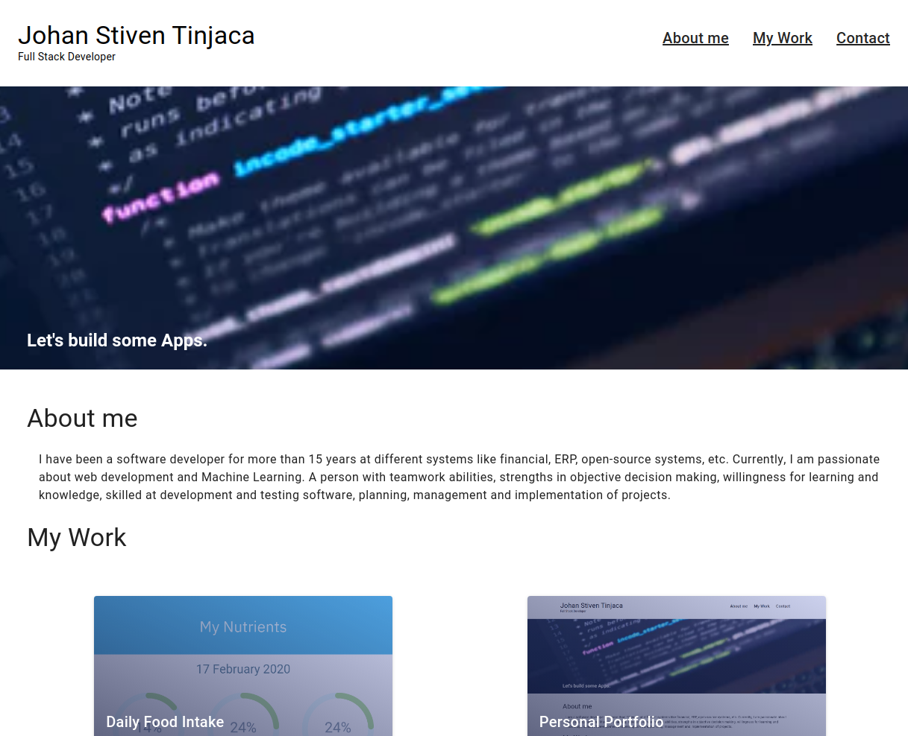

## Personal-portfolio
> Creating my personal portfolio using Vue and Vuetify.

## Screenshot


## Built With

- VueJS
- Vuetify
- npm
- CSS
- ES6

## Project setup
```
npm install
```

### Compiles and hot-reloads for development
```
npm run serve
```

### Compiles and minifies for production
```
npm run build
```

### Lints and fixes files
```
npm run lint
```

### Customize configuration
See [Configuration Reference](https://cli.vuejs.org/config/).

## Author

👤 **Johan Stiven Tinjacá Tocora**

- Github: [@jstiven01](https://github.com/jstiven01)
- Email: [stiven10@gmail.com](mailto:stiven10@gmail.com)
- Twitter: [@TinjacaJohan](https://twitter.com/TinjacaJohan)
- Linkedin: [Johan Tinjacá](https://www.linkedin.com/in/johanstiventinjaca/)
